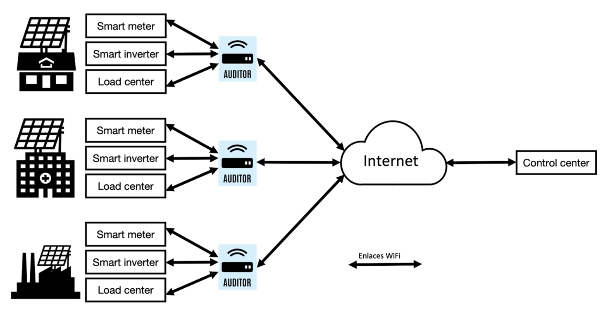

# Secure MQTT: Lightweight and Safe Communication for IoT

## Table of Contents
- [Secure MQTT: Lightweight and Safe Communication for IoT](#secure-mqtt-lightweight-and-safe-communication-for-iot)
  - [Table of Contents](#table-of-contents)
  - [Problem Statement](#problem-statement)
  - [Project Summary](#project-summary)
  - [Usage and Installation](#usage-and-installation)
    - [Prerequisites](#prerequisites)
    - [Hardware Requirements](#hardware-requirements)
    - [Software Dependencies](#software-dependencies)
    - [General Installation](#general-installation)
  - [Appendix](#appendix)
    - [Authors](#authors)
    - [License](#license)

## Problem Statement

[(Back to top)](#table-of-contents)

The present project aims to develop a robust communication infrastructure for efficient and secure data exchange between auditors and a server (see Figure 1). With a focus on energy measurement and monitoring, we aim to establish a fast and secure channel that enables auditors to transmit data to a central server. Leveraging advanced technologies like public key infrastructure (PKI) and encryption algorithms, we will ensure the reliability, confidentiality, and integrity of the transmitted energy data.

|       |
| :-----------------------------------------------------------: |
| *Figure 1: Data exchange between the auditors and the server* |

By implementing a PKI, we aim to address the following challenges:

1. **Authentication and Authorization**: The system needs a reliable method to authenticate the identities of the auditors and the server. Only verified and authorized members should be able to access the server and exchange data with it. The server should also be able to authenticate the auditors to send them general updates and alerts.

2. **Confidentiality**: The system needs to ensure that the data exchanged between the auditors and the server is encrypted and protected from unauthorized access.

3. **Data Integrity and Non-repudiation**: Without a robust PKI in place, there is no guarantee of data integrity and non-repudiation, making it challenging to verify the accuracy and authenticity of audit information exchanged between the auditors and the server.

4. **Scalability and Performance**: As the volume of audit data increases, the network infrastructure must be able to balance the highly variable communication load

Addressing these challenges is critical to ensuring the confidentiality, integrity, and availability of audit information throughout the communication process. By implementing a PKI, we aim to establish a secure channel that enables encrypted communication, robust authentication and authorization mechanisms, data integrity, non-repudiation, and scalable performance. This will bolster the trustworthiness of the communication channel, enhance audit processes, and provide a solid foundation for the secure exchange of sensitive information between the auditors and the server.

## Project Summary

[(Back to top)](#table-of-contents)

The project established a secure MQTT connection between auditors, a Mosquitto Broker hosted on an EC2 instance and an end client hosted in a personal laptop. To ensure the confidentiality, integrity, and authenticity of the transmitted data, TLS encryption and ECDSA signatures were implemented. Auditors generated ECDSA signatures for their messages, which were verified by the end client (and vice versa) using their corresponding public keys. This process ensured that only authenticated auditors could establish a connection and exchange data securely. The following diagram illustrates the overall architecture of the system:

|  |
| :---------------------------------------------------------------: |
| *Figure 2: Proposed architecture for the secure MQTT connection*  |

In addition to the authentication mechanism, TLS encryption was employed to secure the communication channels. This encryption technology provided end-to-end encryption, protecting the confidentiality of the data transmitted between the auditors, the Mosquitto Broker and the end client. It prevented unauthorized access and eavesdropping, ensuring that sensitive information remained confidential. Furthermore, the end client implemented a validation process that processed only messages with valid ECDSA signatures. This ensured the integrity of the data stored in the client's database, enhancing the overall trustworthiness of the system.

By implementing these security measures, the project successfully established a secure and fast MQTT connection, safeguarding the communication and ensuring the authenticity and integrity of the exchanged data.

For more information, please refer to the [project report](docs/report/main.pdf).

## Usage and Installation

### Prerequisites

[(Back to top)](#table-of-contents)

### Hardware Requirements

[(Back to top)](#table-of-contents)

This project was developed using a personal laptop which emulated an Auditor Client via VirtualBox. Consult the detailed specs of the machine in our [Client Creation Guide](src/clients/README.md).

### Software Dependencies

[(Back to top)](#table-of-contents)

The software for the Broker is listed in the [Broker Configuration](src/broker/README.md), we've provided a sample bash snippet to install all the needed dependencies.

The implementation of the Auditor requires mostly preinstalled software from the Python standard library included in most Linux distributions, but for the sake of reproducibility, we recommend installing the dependencies provided in our [Requirements](src/requirements.txt).

### General Installation

[(Back to top)](#table-of-contents)

In order to reproduce our setup you have to follow our guides in the following order:

1. [EC2 Setup](docs/report/)
   1. [Certificate Creation](src/.test_certs/README.md)
2. [Broker Configuration](src/broker/README.md)
3. [Client Creation Guide](src/clients/README.md)

## Appendix

### Authors

[(Back to top)](#table-of-contents)

The present project was a collaboration between the following authors:

1. Juan Pablo Echeagaray González, [contact](mailto:a00830646@tec.mx)
2. Ricardo Camacho Castillo
3. Michelle Yareni Morales Ramón
4. Emily Rebeca Méndez Cruz
5. Daniela García Coindreau
6. Carolina Longoria Lozano

Please contact Juan Pablo Echeagaray González for any questions or comments.

### License

[(Back to top)](#table-of-contents)

This project is licensed under the MIT License - see the [LICENSE](LICENSE) file for details.