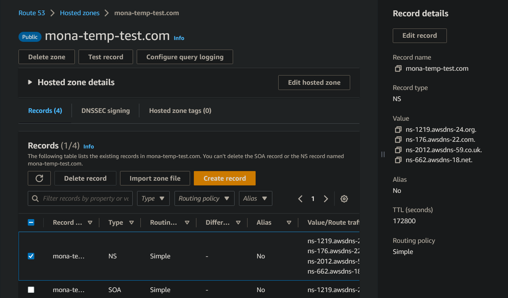

# Extra Documentation

## EC2 Broker Setup

- [Extra Documentation](#extra-documentation)
  - [EC2 Broker Setup](#ec2-broker-setup)
  - [Domain Name Acquisition](#domain-name-acquisition)
  - [EC2 Instance Setup](#ec2-instance-setup)
    - [Domain Name Server Setup](#domain-name-server-setup)
  - [Guide to Sending Data to AWS S3 with Python](#guide-to-sending-data-to-aws-s3-with-python)
    - [Prerequisites](#prerequisites)
    - [Step 1: Create an S3 Bucket](#step-1-create-an-s3-bucket)
    - [Step 2: Create a Python Script](#step-2-create-a-python-script)
      - [Import Necessary Packages](#import-necessary-packages)
      - [AWS Session Initialization](#aws-session-initialization)
    - [Step 3: Define a Function to Send Data to S3](#step-3-define-a-function-to-send-data-to-s3)
    - [Step 4: Send Data to S3](#step-4-send-data-to-s3)
    - [Example data](#example-data)


The Mosquitto Broker needs to be setup in a central server, in this case an EC2 instance from AWS; the following steps were taken to setup the broker.

## Domain Name Acquisition

The present project acquired its domain name from [IONOS](https://www.ionos.com/), but we encourage you to use any domain name provider of your choice. The following links provide information on how to acquire a domain name from IONOS and how to acquire a domain name in general.

- [IONOS Domain Acquisition Guide](https://www.ionos.com/digitalguide/domains/domain-tips/how-do-you-buy-a-domain-name/) **(Recommended)**
- [Google Domains](https://support.google.com/domains/answer/4491208?hl=en)

**NOTE**: The domain does not need to be protected by an SSL certificate in the site from which the domain was bought, the SSL certificate will be created later on inside the EC2 instance.

## EC2 Instance Setup

Before setting up the broker, follow this guides in order:

1. [EC2 Account Setup](https://docs.aws.amazon.com/AWSEC2/latest/UserGuide/get-set-up-for-amazon-ec2.html)
2. [EC2 Instance Setup](https://docs.aws.amazon.com/AWSEC2/latest/UserGuide/EC2_GetStarted.html)

The project created an EC2 instance with the following specs:

- OS: Ubuntu 22.04.3 LTS
- Instance Type: t2.micro
- CPU: 1 vCPU @ 2.4GHz
- RAM: 1 GiB
- Storage: 30 GiB

### Domain Name Server Setup

1. Create a public hosted zone in Route 53 for the acquired domain name, follow [this guide](https://docs.aws.amazon.com/acm/latest/userguide/gs-acm-request-public.html)
   1. As soon as the hosted zone is created, go back to the domain name provider and modify the default DNS server values to use those created by the hosted zone.

|  |
| :---------------------------------------------------------------: |
| *Figure 1: Custom NS from hosted zone (on the right)*  |

2. Request a public certificate from AWS Certificate Manager (ACM) for the acquired domain name, following the steps in [this guide](https://docs.aws.amazon.com/acm/latest/userguide/gs-acm-request-public.html). Register both your domain and the wildcard domain (e.g. `example.com` and `*.example.com`). Wait for the certificate to be verified, this can take up to 30 minutes.
   1. Once the certificate becomes available, click on it; and select _Create record in Route 53_ for both domains.
3. Modify the default Security Group assigned to the EC2 instance to allow inbound traffic from ports 1883 and 8883 from anywhere; there is no need to modify HTTPS, SSH or HTTP ports.
4. In the EC2 instance dashboard look for its public IP address and copy it.
   1. Go back to the hosted zone in Route 53 and create a new record with the copied IP address, this will be the address used to access the broker, you can follow the previous guide to create the record.

## Guide to Sending Data to AWS S3 with Python

This guide will demonstrate how to send a line of data to an AWS S3 bucket each time it's received.

### Prerequisites
1. AWS account with configured credentials. You can configure your AWS CLI credentials by following the instructions in the official AWS guide.
2. Python 3 installed on your machine. Download it here.
3. boto3 and pandas python packages installed. You can install these using pip:

```bash
pip install boto3 pandas
```

### Step 1: Create an S3 Bucket
1. Log in to your AWS account and navigate to the S3 console.
2. Click the Create bucket button.
3. Enter a name for your bucket and click Next.
4. Select the region you want to create your bucket in and click Next.
5. Leave all the default settings and click Next.
6. Click Create bucket.

### Step 2: Create a Python Script
1. Create a new Python script in your favorite editor.
2. Import the boto3 and pandas packages.
3. Create a function that will send a line of data to your S3 bucket.
4. Create a function that will read a line of data from a file.

#### Import Necessary Packages

```python
import boto3
import pandas as pd
from io import StringIO
```


#### AWS Session Initialization

```python
session = boto3.Session(
    aws_access_key_id='YOUR_ACCESS_KEY',
    aws_secret_access_key='YOUR_SECRET_KEY',
    region_name='us-west-2'  # your preferred region
)

s3 = session.resource('s3')
```

Replace 'YOUR_ACCESS_KEY', 'YOUR_SECRET_KEY', and 'us-west-2' with your AWS Access Key ID, Secret Access Key, and preferred region respectively.

### Step 3: Define a Function to Send Data to S3

Next, we define a function that will take in a line of data, convert it to a CSV format using pandas, and then upload it to the specified S3 bucket.

```python
def send_to_s3(data, bucket_name, file_name):
    # Create a DataFrame from the data
    df = pd.DataFrame([data])

    # Create a CSV buffer from the DataFrame
    csv_buffer = StringIO()
    df.to_csv(csv_buffer, index=False)

    # Create the object in the S3 bucket
    s3.Object(bucket_name, file_name).put(Body=csv_buffer.getvalue())
```


The data argument of the function is a list of the data you want to send to the S3 bucket.

### Step 4: Send Data to S3

Now, you can use the send_to_s3 function to send a line of data to the S3 bucket each time it's received.

### Example data

```python
data = ['example', 'data', 'line']
s3(data, 'your_bucket_name', 'data_line.csv')
```

Replace 'your_bucket_name' and 'data_line.csv' with your S3 bucket name and the desired name for your CSV file.

In the above example, a single line of data is sent to the S3 bucket as a CSV file. You can call the send_to_s3 function every time you receive a new line of data, which will overwrite the existing file in the S3 bucket with the new data. If you want to append to the file in the S3 bucket instead, you'll need to first download the existing file, append the new data, and then re-upload it, because S3 does not support appending to files directly.

Please make sure to follow the AWS best practices for handling AWS credentials securely.